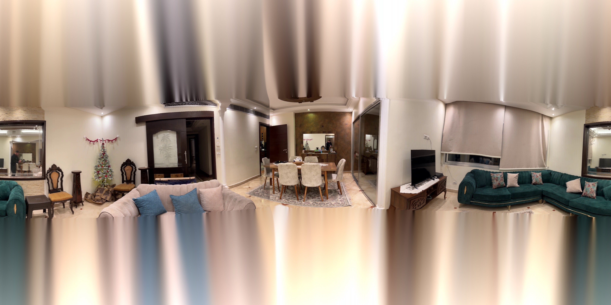

# 360° Spherical Panorama Stitching

Turns a handheld phone sweep into an equirectangular 360° panorama. The geometry
comes entirely from image features and a pure-rotation camera model — no gyroscope
data, no tripod, no stitching app.

**[Live demo](https://360-spherical-stitching.vercel.app)** · [Usage guide](USAGE.md) · [Method](TECHNICAL.md) · [Smoothing notes](TEMPORAL_SMOOTHING.md)



## How it works

Give it a video or a folder of stills. Each stage below is a module in [src/](src/):

1. **Frames** — pulled from video at a fixed interval, uniform count, target fps, or
   by motion, then sorted by EXIF timestamp with a filename fallback
   ([video_utils.py](src/video_utils.py), [io_utils.py](src/io_utils.py)).
2. **Intrinsics** — focal length from EXIF where available, otherwise from a stated
   horizontal field of view or a calibration JSON ([intrinsics.py](src/intrinsics.py)).
3. **Matching** — ORB keypoints, Lowe's ratio test, then RANSAC for a homography per
   adjacent pair. If a pair fails, it retries across the gap at (i, i+2) and
   interpolates ([features.py](src/features.py)).
4. **Rotation** — each homography becomes a rotation, `R = K⁻¹HK`, orthonormalized by
   SVD so it stays a true rotation, then chained into global orientations. Pairs that
   never matched borrow from their neighbours ([rotation.py](src/rotation.py)).
5. **Smoothing** — an optional moving average over the chained rotations. It exists
   because independent per-pair estimates leave a few tenths of a degree of pitch and
   roll error on every frame, which shows up as a staircase along any long straight
   edge. On the sample run it cuts pitch wobble 13.5× and roll wobble 5.2×.
6. **Warp** — inverse-mapped to equirectangular: for each output pixel, take the world
   direction, rotate into each camera's frame, project, sample
   ([warp_sphere.py](src/warp_sphere.py)).
7. **Blend and fill** — `multiband`, `feather`, `sharp`, or `none` across the overlaps,
   then inpainting for whatever the sweep never saw ([blend.py](src/blend.py)).
8. **Viewer** — a self-contained Three.js page written next to the panorama.

## Install

```bash
git clone https://github.com/Kronbii/360-spherical-stitching.git
cd 360-spherical-stitching
pip install -r requirements.txt
```

Python 3.12, OpenCV, NumPy, Pillow, exifread, natsort. CPU only — there is no GPU path
and none is needed.

## Usage

Everything is driven by one YAML file:

```yaml
video: ./IMG_1480_2.MOV          # or: input_dir: ./photos
output_dir: ./output/livingroom

video_extraction:
  method: interval               # uniform · interval · fps · motion
  frame_interval: 2

matching:
  match_full_res: true
  min_inliers: 200
  rotation_smoothing_window: 17  # moving average over chained rotations

intrinsics:
  hfov_deg: 42                   # fallback when EXIF has no focal length

blending:
  method: none                   # multiband · feather · sharp · none

output:
  pano_width: 4096               # height is always width / 2
```

```bash
python run.py config.yaml
```

The run prints a rotation summary as it goes — recovered sweep, per-step angle, and any
pair whose homography looked suspicious. Output lands in `output_dir`:

```
output/livingroom/
├── panorama.jpg          # the equirectangular result
├── frames/               # extracted frames, when the input was video
├── intrinsics.json       # what the camera model resolved to
├── config.json           # the exact settings this run used
└── viewer/index.html     # drag-to-look viewer, open it in a browser
```

Some browsers refuse to load the panorama over `file://`. Serve it instead:

```bash
cd output/livingroom && python -m http.server 8000   # then open localhost:8000/viewer/
```

[USAGE.md](USAGE.md) documents every option and its default.

## What one run looks like

A 309-frame handheld sweep of a living room, every 2nd frame of a phone video, matched
at full 1080×1920 resolution on a Ryzen 7 5800H:

| | |
|---|---|
| Frames in | 309 |
| Recovered sweep | 333° |
| RANSAC inliers per pair | 921 median |
| Pairs recovered by interpolation | 15 of 308 |
| Sphere actually imaged | 36.9%, spanning +31° to −37° elevation |
| Output | 4096 × 2048 |

| Stage | Time |
|---|---|
| Feature matching, 308 pairs at full resolution | 19 s |
| Warping 309 frames to 4096 × 2048 | 96 s |
| Gap fill | 4 s |
| **Total** | **~2 min** |

The demo site walks through the same run stage by stage, including a real ORB match
visualization and a wipe comparison of smoothing on versus off:
**[360-spherical-stitching.vercel.app](https://360-spherical-stitching.vercel.app)**

## Assumptions and limits

- **Rotation only.** The camera is assumed to turn about its optical centre. Translate
  while sweeping and nearby objects will not line up — that is parallax, and a
  homography cannot represent it.
- **A phone-height sweep does not cover a sphere.** One horizontal pass images roughly a
  third of it; the rest is inpainted from its surroundings and will look smeared. Tilt up
  and down across several passes if you want real pole coverage.
- **Texture drives the estimate.** Blank walls, blown highlights, and repeating patterns
  produce few usable inliers. The pipeline carries on by borrowing a neighbour's rotation
  rather than dropping the frame.
- **No bundle adjustment and no exposure matching.** Error accumulates along the chain
  instead of being distributed around the loop, and frames keep their own exposure.

## Known issues

- The smoothing window clamps at the ends of the sequence and leaves the first and last
  rotations untouched. On a clip that finishes mid-motion this drags the tail backwards
  and snaps the final frame forward — 5.4° on the sample run, against a largest honest
  step of 1.9°. Reflecting the sequence at the edges would fix it.
- Part of the test suite is stale: several tests construct `CalibrationData(source=...)`,
  a keyword the dataclass no longer takes.

## Tests

```bash
python run_tests.py          # or: pytest -q
```

186 tests across the config, IO, intrinsics, feature, rotation, blending, and warping
modules.

## Repository layout

```
run.py            entry point: load config, extract frames, run the pipeline
src/pipeline.py   the eight stages, in order, with logging
src/              one module per stage (see "How it works")
tests/            pytest suite
docs/             the demo site (deployed on Vercel)
showcase/         sample panorama and capture video
```

## License

MIT — see [LICENSE](LICENSE). Contributions welcome; see
[CONTRIBUTING.md](CONTRIBUTING.md).
